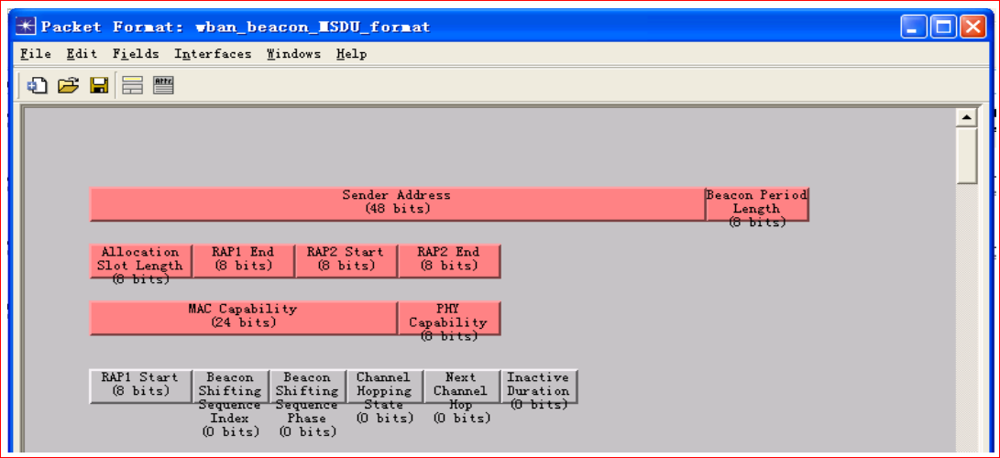

# MAC 层 beacon 管理帧模块

由于 OPNET 提供了对数据包格式的直接支持——即包格式编辑器，因此对于原 IEEE 802.15.6 标准，beacon 帧格式各域信息如下图所示。

Hub 在每个超帧的起始处在 WBAN 网络中广播 beacon 帧，其他 Node 接收到 beacon 帧后解析 beacon 帧各域信息，即可确定 EAP、RAP、MAP1 等各阶段起始 slot。随后即可使用 CSMA/CA 或者 Scheduling 算法在相应 slot 发送数据包。

## 紧急业务处理模块

为了更好地对紧急业务进行处理， 该仿真平台从以下几方面对紧急业务提供支持:

1. 应用层数据包产生模块中形成的数据包中带有 User Priority 域，MAC 层可根据此域的值获知数据包的用户优先级信息。如 User Priority 域中设定的值为 7，即表示该包为紧急业务包。
2. wban_mac 模块为队列模块， 具有构建和缓存子队列的功能， 如果节点应用层有产生紧急业务包，则紧急业务包在队列中将会有 OPNET 平台中提供的优先级标志。
3. 节点发包时优先取出 MAC 层数据子队列中优先级较高的数据包。
4. MAP 阶段对各节点进行时隙分配时优先分配数据子队列中优先级较高的节点。
5. EAP 阶段仅为紧急业务包服务，紧急业务包可在此阶段传输。
6. 除了 EAP 阶段，紧急业务包还可在 RAP、MAP1、MAP2 和 CAP 阶段传输。换句话说，当节点获得接入信道的机会时，如果它有紧急业务，那么优先发送紧急业务。