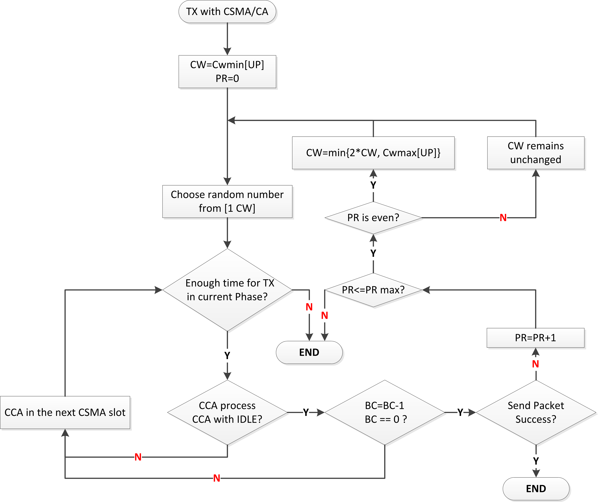

# IEEE 802.15.6 CSMA/CA 模块（竞争接入阶段）

由于 IEEE 802.15.6 中的 CSMA/CA 和 802.11 及 802.15.4 协议中均不相同，标准中定义的 CSMA/CA 接入算法如下图所示。

我们针对 IEEE 802.15.6 标准中定义的 CSMA/CA 在 OPNET 仿真平台中做了详细的仿真实现，实现细节框图如图 26 所示。 “PR”为“Packet Retries”的缩写，表示包重传次数； “BC”则为“Backoff Counter”的缩写，表示退避计数器的值。

