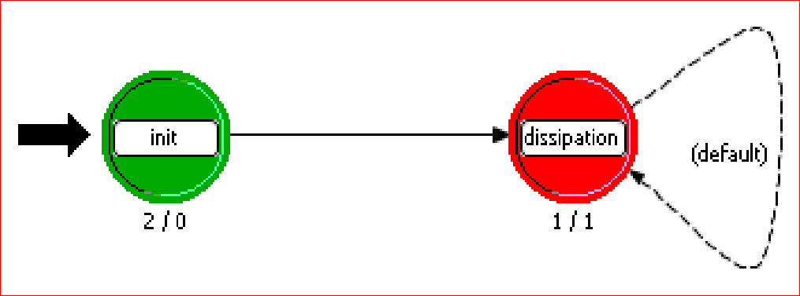

# 能量模块

为了能对整个通信系统中消耗的能量有更精细化的计算，尤其是对于能耗要求相对较高的体域网，能耗是个重要的指标。该仿真平台参考了 IEEE 802.15.4 开源的能量模块。该能量负责统计各节点在发送、接收、执行 CCA、空闲和睡眠阶段的能量消耗的情况。能量计算模块在节点模型中的图示为“BATTERY MODULE” 。其在 OPNET中的进程模型有限状态机实现可用下图来表示。

init 状态负责能量计算模块的初始化，dissipation 状态则负责更新当前节点能量消耗情况。对于通常的传感器节点来说，能耗主要集中在以下四个部分：

1. 发送模式
2. 接收模式
3. 空闲模式
4. 睡眠模式

能耗的具体计算公式则可以表示为 $$Energy ~Consumption(Joule) = \sum _{i} current_i \cdot time_i \cdot voltage$$.

四种模式下的电流值和电压值可以通过预设值给出，对于时间的计算则可以分成三类：

1. 发送/接收模式：time_1,2 = 包大小/数据传输速率
2. 空闲模式：time_3 = 当前仿真时刻 − 最近的上一次空闲时刻
3. 睡眠模式：time_4 = 当前仿真时刻 − 最近的上一次睡眠时刻

其中发送和接收模式下能量消耗最为明显， 空闲模式和睡眠模式功耗均很小。由于节点执行 CCA 过程时消耗的功率和接收功率相当，因此 CCA 过程的功耗可使用接收模式下的功耗来计算。

在 OPNET 仿真具体实现中，该平台设置了发送、接收、CCA 过程、活动阶段结束和睡眠阶段结束四种远程中断， 每当这五种事件中的任何一个发生时都会产生相应的远程中断。通过中断类型返回的中断码（预先设置好） ，我们可以在电池模块中的进程模型中进一步区分以上五种模式，并从 OPNET 中获取相关的中断信息，诸如电流值，电压值和持续时间，从而计算出在每一种模式下的能耗，进而得到整体能耗。