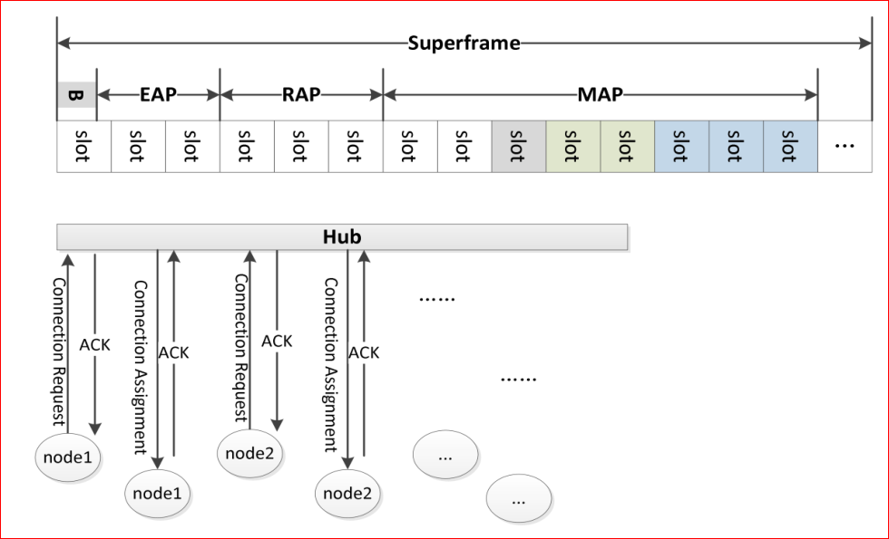

# MAC 层 Scheduling 模块(非竞争阶段)

对于 Scheduling 的实现方式，在 IEEE 802.15.6 中的定义如下：

1. Node在MAP之前首先向Hub发送Connection Request帧请求一定的Slot时隙数。
2. Hub 收到 Node 发送到 Request 请求后向 Node 返回 ConnectionAssignment 帧以通知其在 MAP 阶段中可使用的 Slot 起止数。

详细的分配方案可用下图表示，MAP 中不同颜色的 slot 表示不同节点在MAP 阶段所获得的 slot。可以使用贪心算法实现。



### SNR

SNR 统计分为两种方式，Node 到 Hub 和 Hub 到 Node，数据结构分别为

```
/* SINR received by Hub(Node -> Hub) */
double	\sv_snr_hub[NODE_ALL_MAX][SF_NUM];

/* SINR received by Node(Hub -> Node) */
double	hb_snr_node[NODE_ALL_MAX][SF_NUM];
```

节点只统计自身，Hub则统计本网内的节点。

在收到来自物理层发送过来的数据包时，判断一下是否为 Hub，随后记录。