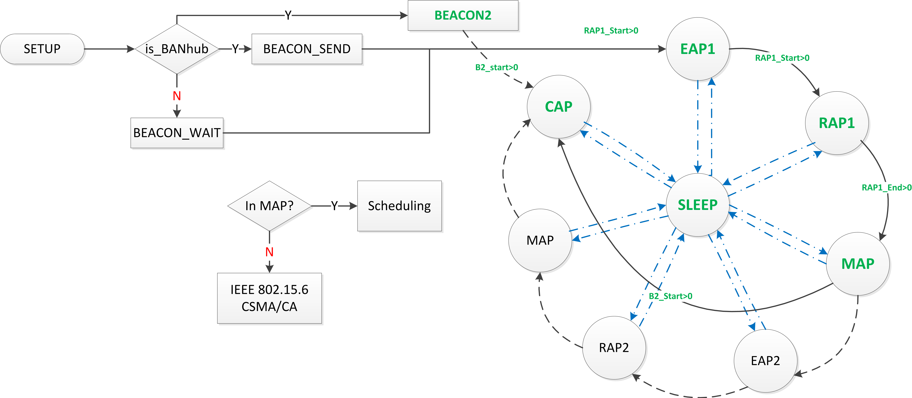

# MAC 层超帧模块

在 IEEE 802.15.6 协议中基于 beacon 的超帧结构是以超帧的形式周期性的广播 beacon 进行通信的。Hub 在超帧结构的起始处广播 beacon 帧，beacon 帧中包含整段超帧的长度信息、RAP 阶段的起始 slot，EAP1的结束slot等， 而CAP的起始及结束 slot 则由 beacon2 控制帧给出。 IEEE 802.15.6 标准的超帧结构实现整体框图如下图所示。

CSMA/CA 和 TDMA Scheduling 调度采用了子模块的方式实现。在 MAP 中采用 Scheduling 调度方式（Contention-free） ，在非MAP 如 EAP/RAP/CAP 阶段则采用 IEEE 802.15.6 中定义的 CSMA/CA 协议（Contention-based access）。