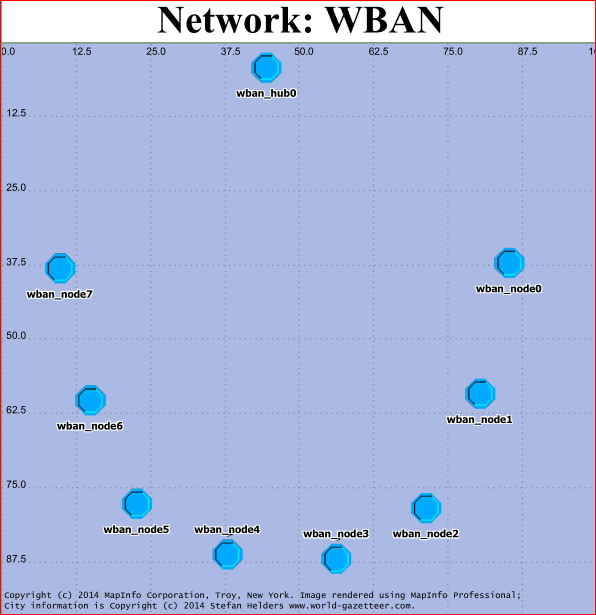
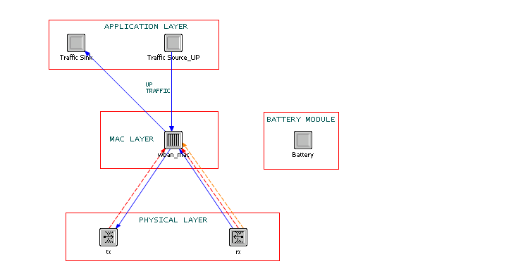

# WBAN 节点模型

WBAN中的节点可分为两类：
1. Hub: WBAN中的中心协调节点，用于协调其他节点的介质访问控制和管理控制。
2. Node: WBAN中的普通节点，可向Hub发送业务。

相应的网络模型如下图所示。

仿真平台中对 WBAN 传感器节点各模块的分层设计如下图所示，节点之间的数据帧传送关系如图蓝线所示，红虚线为统计量传输通道，与正常数据传输通道互不影响，仅用于 MAC 层获取物理层信道信息用。

节点中各模块功能如下：

1. 应用层（APPLICATION LAYER）
	- Traffic Source_UP为业务源，产生不同业务优先级的数据包
	- Traffic Sink接收来自WBAN MAC层发来的数据包并做适当处理
2. 介质访问控制层（MAC LAYER）
	- 从应用层接收到数据包，并做解包、入队等操作
	- Hub形成beacon帧
	- MAC数据帧形成并发送至物理层传输
	- CSMA/CA算法实现
	- Scheduling算法实现
	- 转发从应用层发来的数据包
	- 从物理层获得信道访问情况（获取CCA结果）
3. 物理层（PHYSICAL LAYER）
	- 工作在IEEE 802.15.6标准中的Narrowband物理层
	- 用于构建PHY Layer的管道模型
	- 当前通道内空闲信道评估（CCA）
	- 数据传输和接收
	- 使用QPSK调制