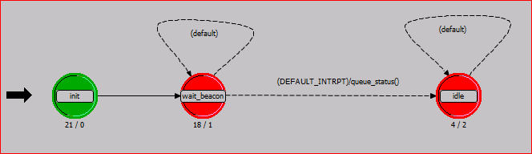

# MAC 层源码分析

下图为 MAC 层模块的有限状态机实现，看似简单，其实是由于协议逻辑比较复杂，所以将大部分状态跳转都放进了源码里头，并没有直接体现在有限状态机转化图上。



如上图所示，MAC 层模块主要由三部分状态机实现，绿色的`init`模块为初始化过程，`wait_beacon`为等待beacon帧的状态机，最后的`idle`为核心状态跳转，主要在程序内部使用自中断和中断处理函数组成。

## init 初始化

`init`模块的入口代码为：

```c
wban_mac_init ();

//op_intrpt_priority_set (OPC_INTRPT_SELF, START_OF_GTS_PERIOD, -4);
op_intrpt_priority_set (OPC_INTRPT_SELF, END_OF_EAP1_PERIOD_CODE, -1);
op_intrpt_priority_set (OPC_INTRPT_SELF, START_OF_RAP1_PERIOD_CODE, -2);
op_intrpt_priority_set (OPC_INTRPT_SELF, END_OF_RAP1_PERIOD_CODE, -1);
op_intrpt_priority_set (OPC_INTRPT_SELF, START_OF_MAP1_PERIOD_CODE, -2);
op_intrpt_priority_set (OPC_INTRPT_SELF, END_OF_MAP1_PERIOD_CODE, -1);
op_intrpt_priority_set (OPC_INTRPT_SELF, SEND_B2_FRAME, -2);
op_intrpt_priority_set (OPC_INTRPT_SELF, START_OF_MAP2_PERIOD_CODE, -2);
op_intrpt_priority_set (OPC_INTRPT_SELF, END_OF_MAP2_PERIOD_CODE, -1);
op_intrpt_priority_set (OPC_INTRPT_SELF, START_OF_CAP_PERIOD_CODE, -2);
op_intrpt_priority_set (OPC_INTRPT_SELF, END_OF_CAP_PERIOD_CODE, -1);
op_intrpt_priority_set (OPC_INTRPT_SELF, BEACON_INTERVAL_CODE, -2);
op_intrpt_priority_set (OPC_INTRPT_SELF, BACKOFF_EXPIRATION_CODE, 15); // the highest priority
```

`wban_mac_init()`为 MAC 层模块初始化函数，主要用于读取在节点和 MAC 模块处设定的参数，区分当前节点是 Hub 还是 Node. 如果是 Hub 则读取超帧相关参数，若为 Node 则读取 `Connection Request` 参数。最后设置统计量参数及协议状态参数，较为重要的参数有：

1. `waitForACK` - 是否在等待对方的 ACK?
2. `TX_ING` - 是否正处于包传输过程中？如果是的话就不能再向物理广播模块发送包。
3. `attemptingToTX` - 一切都已就绪，等待将包传输至物理层。可以理解为同步锁，某个包已获得发送至物理层的权利，其他包再要发就得等资源释放出来。

`op_intrpt_priority_set`用于设置中断的优先级，因为如果多个自中断在同一时刻同时产生时，中断的处理是有一定顺序区分的，故需要妥善设置不同中断的优先级。

## `wait_beacon`等待beacon

`wait_beacon`状态机入口代码如下，主要用于区分当前节点是否为Hub, 若为 Hub 则周期性广播 beacon 帧。若为 普通节点 Node 则接收其他节点发送的包，接收包的入口函数为 `wban_parse_incoming_frame`, 接收包之后即转向下一个状态机`idle`。

```
/************************************************************************
In this state a node check if it is a Hub:
- Node is a Hub : it sends beacon frame interval
- Node is a Node : it waits until a beacon frame from the network. 
*/
    
/* get the packet from the stream */
switch (op_intrpt_type()) {
	case OPC_INTRPT_STRM : 
	{
		wban_parse_incoming_frame ();
		op_intrpt_schedule_self (op_sim_time (), DEFAULT_CODE); // -> to IDLE state
		break;
	};
	default :
	{
	};
}
```

## `idle`模块

`idle`模块仅有出口执行代码，代码也就一行。

```
/* Call the interrupt processing routing for each interrupt */
wban_mac_interrupt_process();
```

用于捕捉所有中断，整个状态机跳转自此全部由代码接管，不显式出现于状态机中。显示使用状态机相对好懂一些，但暂时精力有限，也就不打算继续做大的改动了。