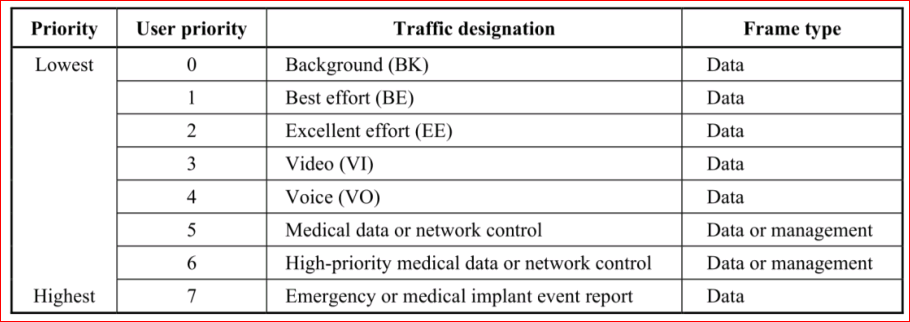
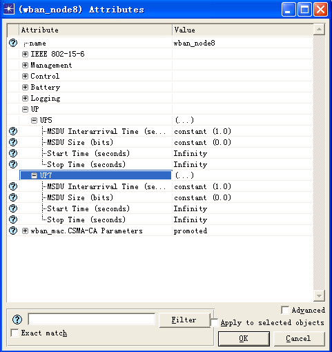

# WBAN  应用层业务模型

WBAN 中的业务共有8种不同用户优先级，不同用户优先级对应的业务类型如下图所示：

作为应用层的数据包业务源产生模块，该模块支持设置8种不同用户优先级业务的到达时间间隔(可以选择均匀分布/指数分布等分布函数)，数据包大小，起始时间及结束时间。

业务流特性支持如指数分布，泊松分布和常数分布等典型概率分布，同时该仿真平台还支持自定义的概率分布函数，用以对特殊业务流特性进行仿真测试。
如下图所示，对各用户优先级的数据包业务流属性的设置可在相应节点属性处定义。可分别对不同用户优先级的数据包设置以下参数：

1. 数据包产生时间间隔（MSDU Interval Time）——通过函数给出，如泊松分布/常数分布。
2. 数据包大小分布（MSDU Size）——通过函数给出，如泊松/常数分布。
3. 数据包产生的开始时间（Start Time）——通常设置为大于 0。
4. 数据包产生的结束时间（Stop Time）——通常设置为 Infinity 即可

